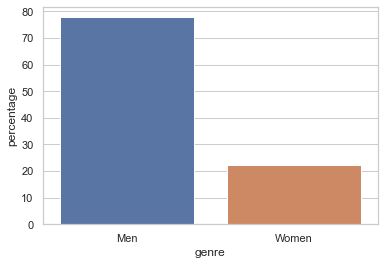
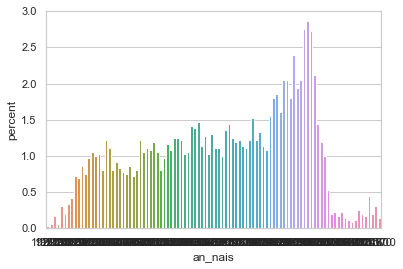
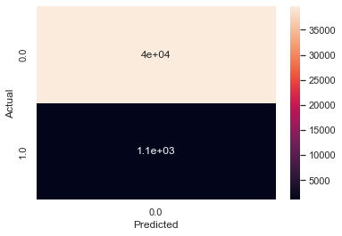
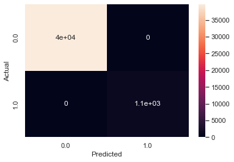
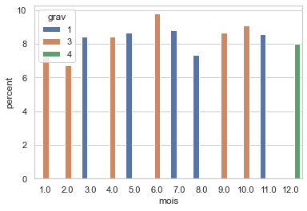
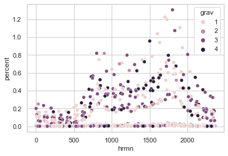

# PROJET TECHNO DATA

## Auteurs

Adrien Chaptal

Gael Rousseau

## Declaration librairies


```python
# imports
import numpy as np
import pandas as pd
import matplotlib.pyplot as plt
# show plots in the notebook
%matplotlib inline
import seaborn as sns
from sklearn.model_selection import train_test_split
from sklearn.model_selection import cross_val_score
from sklearn.linear_model import LogisticRegression
from sklearn.metrics import classification_report, confusion_matrix
from sklearn import preprocessing
from sklearn import metrics
from sklearn.tree import DecisionTreeClassifier

import warnings
warnings.filterwarnings('ignore')
```

## I - Analyse et Preparation des données

1. Etudier les données en affichants les informations correspondantes (colonnes, indice, etc) :


```python
## TO DO
df_caracteristique = pd.read_csv('./bdd/caracteristiques-2017.csv', encoding ='latin1')
print(df_caracteristique.shape)
```

    (60701, 16)
    


```python
df_lieux = pd.read_csv('./bdd/lieux-2017.csv', encoding ='latin1')

print(df_lieux.shape)
```

    (60701, 18)
    


```python
df_usagers = pd.read_csv('./bdd/usagers-2017.csv', encoding ='latin1')

print(df_usagers.shape)
```

    (136021, 12)
    


```python
df_vehicules = pd.read_csv('./bdd/vehicules-2017.csv', encoding ='latin1')

print(df_vehicules.shape)
```

    (103546, 9)
    

2. Fusionner les fichiers de donnés 


```python
frames = [df_caracteristique, df_lieux, df_usagers, df_vehicules]
df_total = pd.concat(frames, axis=1)

print(df_total.shape)
```

    (136021, 55)
    

3. Nettoyer la base de données

Ex : Identifier le pourcentage de valeurs NaN dans la base et éliminez les colonnes où la majorité
des valeurs sont NaN.


```python

df = df_total.loc[:, df_total.isnull().mean() < .5]

#Also we remove the colums in named "num_veh" because we will not need it and it's not numerical values   
df = df.loc[:,~df.columns.duplicated()]
df.drop(['num_veh'], axis=1, inplace=True)

df
```


<div>
<style scoped>
    .dataframe tbody tr th:only-of-type {
        vertical-align: middle;
    }

    .dataframe tbody tr th {
        vertical-align: top;
    }

    .dataframe thead th {
        text-align: right;
    }
</style>
<table border="1" class="dataframe">
  <thead>
    <tr style="text-align: right;">
      <th></th>
      <th>Num_Acc</th>
      <th>place</th>
      <th>catu</th>
      <th>grav</th>
      <th>sexe</th>
      <th>trajet</th>
      <th>secu</th>
      <th>locp</th>
      <th>actp</th>
      <th>etatp</th>
      <th>an_nais</th>
      <th>senc</th>
      <th>catv</th>
      <th>occutc</th>
      <th>obs</th>
      <th>obsm</th>
      <th>choc</th>
      <th>manv</th>
    </tr>
  </thead>
  <tbody>
    <tr>
      <th>0</th>
      <td>201700000001</td>
      <td>1.0</td>
      <td>1</td>
      <td>3</td>
      <td>1</td>
      <td>9.0</td>
      <td>13.0</td>
      <td>0.0</td>
      <td>0.0</td>
      <td>0.0</td>
      <td>1968.0</td>
      <td>0.0</td>
      <td>7.0</td>
      <td>0.0</td>
      <td>0.0</td>
      <td>2.0</td>
      <td>3.0</td>
      <td>9.0</td>
    </tr>
    <tr>
      <th>1</th>
      <td>201700000001</td>
      <td>2.0</td>
      <td>2</td>
      <td>3</td>
      <td>2</td>
      <td>9.0</td>
      <td>11.0</td>
      <td>0.0</td>
      <td>0.0</td>
      <td>0.0</td>
      <td>1973.0</td>
      <td>0.0</td>
      <td>10.0</td>
      <td>0.0</td>
      <td>0.0</td>
      <td>2.0</td>
      <td>3.0</td>
      <td>13.0</td>
    </tr>
    <tr>
      <th>2</th>
      <td>201700000001</td>
      <td>1.0</td>
      <td>1</td>
      <td>3</td>
      <td>1</td>
      <td>1.0</td>
      <td>13.0</td>
      <td>0.0</td>
      <td>0.0</td>
      <td>0.0</td>
      <td>1967.0</td>
      <td>0.0</td>
      <td>7.0</td>
      <td>0.0</td>
      <td>0.0</td>
      <td>0.0</td>
      <td>1.0</td>
      <td>16.0</td>
    </tr>
    <tr>
      <th>3</th>
      <td>201700000002</td>
      <td>1.0</td>
      <td>1</td>
      <td>1</td>
      <td>1</td>
      <td>0.0</td>
      <td>11.0</td>
      <td>0.0</td>
      <td>0.0</td>
      <td>0.0</td>
      <td>1953.0</td>
      <td>0.0</td>
      <td>1.0</td>
      <td>0.0</td>
      <td>0.0</td>
      <td>0.0</td>
      <td>7.0</td>
      <td>1.0</td>
    </tr>
    <tr>
      <th>4</th>
      <td>201700000002</td>
      <td>1.0</td>
      <td>1</td>
      <td>3</td>
      <td>1</td>
      <td>5.0</td>
      <td>22.0</td>
      <td>0.0</td>
      <td>0.0</td>
      <td>0.0</td>
      <td>1960.0</td>
      <td>0.0</td>
      <td>10.0</td>
      <td>0.0</td>
      <td>0.0</td>
      <td>2.0</td>
      <td>1.0</td>
      <td>1.0</td>
    </tr>
    <tr>
      <th>...</th>
      <td>...</td>
      <td>...</td>
      <td>...</td>
      <td>...</td>
      <td>...</td>
      <td>...</td>
      <td>...</td>
      <td>...</td>
      <td>...</td>
      <td>...</td>
      <td>...</td>
      <td>...</td>
      <td>...</td>
      <td>...</td>
      <td>...</td>
      <td>...</td>
      <td>...</td>
      <td>...</td>
    </tr>
    <tr>
      <th>136016</th>
      <td>201700060699</td>
      <td>1.0</td>
      <td>1</td>
      <td>1</td>
      <td>2</td>
      <td>9.0</td>
      <td>11.0</td>
      <td>0.0</td>
      <td>0.0</td>
      <td>0.0</td>
      <td>1974.0</td>
      <td>NaN</td>
      <td>NaN</td>
      <td>NaN</td>
      <td>NaN</td>
      <td>NaN</td>
      <td>NaN</td>
      <td>NaN</td>
    </tr>
    <tr>
      <th>136017</th>
      <td>201700060700</td>
      <td>1.0</td>
      <td>1</td>
      <td>1</td>
      <td>2</td>
      <td>9.0</td>
      <td>11.0</td>
      <td>0.0</td>
      <td>0.0</td>
      <td>0.0</td>
      <td>1987.0</td>
      <td>NaN</td>
      <td>NaN</td>
      <td>NaN</td>
      <td>NaN</td>
      <td>NaN</td>
      <td>NaN</td>
      <td>NaN</td>
    </tr>
    <tr>
      <th>136018</th>
      <td>201700060700</td>
      <td>1.0</td>
      <td>1</td>
      <td>4</td>
      <td>1</td>
      <td>9.0</td>
      <td>21.0</td>
      <td>0.0</td>
      <td>0.0</td>
      <td>0.0</td>
      <td>1991.0</td>
      <td>NaN</td>
      <td>NaN</td>
      <td>NaN</td>
      <td>NaN</td>
      <td>NaN</td>
      <td>NaN</td>
      <td>NaN</td>
    </tr>
    <tr>
      <th>136019</th>
      <td>201700060700</td>
      <td>2.0</td>
      <td>2</td>
      <td>4</td>
      <td>2</td>
      <td>9.0</td>
      <td>21.0</td>
      <td>0.0</td>
      <td>0.0</td>
      <td>0.0</td>
      <td>1990.0</td>
      <td>NaN</td>
      <td>NaN</td>
      <td>NaN</td>
      <td>NaN</td>
      <td>NaN</td>
      <td>NaN</td>
      <td>NaN</td>
    </tr>
    <tr>
      <th>136020</th>
      <td>201700060701</td>
      <td>1.0</td>
      <td>1</td>
      <td>4</td>
      <td>1</td>
      <td>1.0</td>
      <td>21.0</td>
      <td>0.0</td>
      <td>0.0</td>
      <td>0.0</td>
      <td>1992.0</td>
      <td>NaN</td>
      <td>NaN</td>
      <td>NaN</td>
      <td>NaN</td>
      <td>NaN</td>
      <td>NaN</td>
      <td>NaN</td>
    </tr>
  </tbody>
</table>
<p>136021 rows × 18 columns</p>
</div>


4. Supprimer les variables dont la majorité des observations sont manquantes


```python
# Count number of zeros in all columns of Dataframe
for column_name in df.columns:
    shape=df.shape[0]
    column = df[column_name]
    # Get the count of Zeros in column 
    count = (column == 0).sum()
    pct=count/df.shape[0]
    if(isinstance(pct, pd.Series)):
        print("Can't process Series...")
    elif(pct > 0.5):
        df.drop([column_name], axis=1, inplace=True)
        print("Removing column ", column_name)
    
df
```

    Removing column  locp
    Removing column  actp
    Removing column  etatp
    Removing column  occutc
    Removing column  obs
    


<div>
<style scoped>
    .dataframe tbody tr th:only-of-type {
        vertical-align: middle;
    }

    .dataframe tbody tr th {
        vertical-align: top;
    }

    .dataframe thead th {
        text-align: right;
    }
</style>
<table border="1" class="dataframe">
  <thead>
    <tr style="text-align: right;">
      <th></th>
      <th>Num_Acc</th>
      <th>place</th>
      <th>catu</th>
      <th>grav</th>
      <th>sexe</th>
      <th>trajet</th>
      <th>secu</th>
      <th>an_nais</th>
      <th>senc</th>
      <th>catv</th>
      <th>obsm</th>
      <th>choc</th>
      <th>manv</th>
    </tr>
  </thead>
  <tbody>
    <tr>
      <th>0</th>
      <td>201700000001</td>
      <td>1.0</td>
      <td>1</td>
      <td>3</td>
      <td>1</td>
      <td>9.0</td>
      <td>13.0</td>
      <td>1968.0</td>
      <td>0.0</td>
      <td>7.0</td>
      <td>2.0</td>
      <td>3.0</td>
      <td>9.0</td>
    </tr>
    <tr>
      <th>1</th>
      <td>201700000001</td>
      <td>2.0</td>
      <td>2</td>
      <td>3</td>
      <td>2</td>
      <td>9.0</td>
      <td>11.0</td>
      <td>1973.0</td>
      <td>0.0</td>
      <td>10.0</td>
      <td>2.0</td>
      <td>3.0</td>
      <td>13.0</td>
    </tr>
    <tr>
      <th>2</th>
      <td>201700000001</td>
      <td>1.0</td>
      <td>1</td>
      <td>3</td>
      <td>1</td>
      <td>1.0</td>
      <td>13.0</td>
      <td>1967.0</td>
      <td>0.0</td>
      <td>7.0</td>
      <td>0.0</td>
      <td>1.0</td>
      <td>16.0</td>
    </tr>
    <tr>
      <th>3</th>
      <td>201700000002</td>
      <td>1.0</td>
      <td>1</td>
      <td>1</td>
      <td>1</td>
      <td>0.0</td>
      <td>11.0</td>
      <td>1953.0</td>
      <td>0.0</td>
      <td>1.0</td>
      <td>0.0</td>
      <td>7.0</td>
      <td>1.0</td>
    </tr>
    <tr>
      <th>4</th>
      <td>201700000002</td>
      <td>1.0</td>
      <td>1</td>
      <td>3</td>
      <td>1</td>
      <td>5.0</td>
      <td>22.0</td>
      <td>1960.0</td>
      <td>0.0</td>
      <td>10.0</td>
      <td>2.0</td>
      <td>1.0</td>
      <td>1.0</td>
    </tr>
    <tr>
      <th>...</th>
      <td>...</td>
      <td>...</td>
      <td>...</td>
      <td>...</td>
      <td>...</td>
      <td>...</td>
      <td>...</td>
      <td>...</td>
      <td>...</td>
      <td>...</td>
      <td>...</td>
      <td>...</td>
      <td>...</td>
    </tr>
    <tr>
      <th>136016</th>
      <td>201700060699</td>
      <td>1.0</td>
      <td>1</td>
      <td>1</td>
      <td>2</td>
      <td>9.0</td>
      <td>11.0</td>
      <td>1974.0</td>
      <td>NaN</td>
      <td>NaN</td>
      <td>NaN</td>
      <td>NaN</td>
      <td>NaN</td>
    </tr>
    <tr>
      <th>136017</th>
      <td>201700060700</td>
      <td>1.0</td>
      <td>1</td>
      <td>1</td>
      <td>2</td>
      <td>9.0</td>
      <td>11.0</td>
      <td>1987.0</td>
      <td>NaN</td>
      <td>NaN</td>
      <td>NaN</td>
      <td>NaN</td>
      <td>NaN</td>
    </tr>
    <tr>
      <th>136018</th>
      <td>201700060700</td>
      <td>1.0</td>
      <td>1</td>
      <td>4</td>
      <td>1</td>
      <td>9.0</td>
      <td>21.0</td>
      <td>1991.0</td>
      <td>NaN</td>
      <td>NaN</td>
      <td>NaN</td>
      <td>NaN</td>
      <td>NaN</td>
    </tr>
    <tr>
      <th>136019</th>
      <td>201700060700</td>
      <td>2.0</td>
      <td>2</td>
      <td>4</td>
      <td>2</td>
      <td>9.0</td>
      <td>21.0</td>
      <td>1990.0</td>
      <td>NaN</td>
      <td>NaN</td>
      <td>NaN</td>
      <td>NaN</td>
      <td>NaN</td>
    </tr>
    <tr>
      <th>136020</th>
      <td>201700060701</td>
      <td>1.0</td>
      <td>1</td>
      <td>4</td>
      <td>1</td>
      <td>1.0</td>
      <td>21.0</td>
      <td>1992.0</td>
      <td>NaN</td>
      <td>NaN</td>
      <td>NaN</td>
      <td>NaN</td>
      <td>NaN</td>
    </tr>
  </tbody>
</table>
<p>136021 rows × 13 columns</p>
</div>


5. Remplir les valeurs NaN par différentes méthodes


```python
def fill_nas_by_type(df, col_name):
    """Fill null values in df according to col_name type
    
    Parameters
    ----------
    df : dataframe, (default=None)
        input dataframe
    col_name : str, (default=None)
        column with null values to fill
        
    Returns
    -------
    df with filled values in col_name
    """
    if (col_name == "trajet"):
        df[col_name] = df[col_name].fillna(value=9)
    elif (col_name == "place"):
        df[col_name] = df[col_name].fillna(df[col_name].value_counts()[:1].index.tolist()[0])
    elif (col_name == "an_nais"):
        df[col_name] = df[col_name].fillna(float(df[col_name].median()))
    elif (col_name == "catv"):
        df[col_name] = df[col_name].fillna(value=99)
    elif (col_name == "obsm"):
        df[col_name] = df[col_name].fillna(value=99)
    elif (col_name == "choc"):
        df[col_name] = df[col_name].fillna(value=9)
    elif (col_name == "manv"):
        df[col_name] = df[col_name].fillna(value=25)
    elif (col_name == "senc"):
        df[col_name] = df[col_name].fillna(df[col_name].value_counts()[:1].index.tolist()[0])
    elif (col_name == "num_veh"):
        df[col_name] = df[col_name].iloc[:, 0].fillna(pd.Series(np.random.choice(['A01', 'B01', 'C01'], p=[0.52, 0.30, 0.18], size=len(df))))
        df[col_name] = df[col_name].iloc[:, 1].fillna(pd.Series(np.random.choice(['A01', 'B01', 'C01'], p=[0.52, 0.30, 0.18], size=len(df))))
    elif (col_name == "Num_Acc"):
        df[col_name] = df[col_name].fillna(method='ffill')
    elif (col_name == "secu"):
        df[col_name] = df[col_name].fillna(df[col_name].value_counts()[:1].index.tolist()[0])
    return df

cols_to_fill = list(df.columns)

print(df.isnull().sum(axis = 0))

print(df.isnull().sum().sum())
for x in cols_to_fill:
    df = fill_nas_by_type(df, x)
print(df.isnull().sum().sum())
print(df.isnull().sum(axis = 0))
```

    Num_Acc        0
    place      11802
    catu           0
    grav           0
    sexe           0
    trajet        11
    secu        8950
    an_nais       37
    senc       32543
    catv       32475
    obsm       32517
    choc       32510
    manv       32505
    dtype: int64
    183350
    0
    Num_Acc    0
    place      0
    catu       0
    grav       0
    sexe       0
    trajet     0
    secu       0
    an_nais    0
    senc       0
    catv       0
    obsm       0
    choc       0
    manv       0
    dtype: int64
    

6. Analyser les données par les statistiques (min, max, médiane)


```python
## TO DO

for col_name in df.columns:
    
    if(col_name != "Num_Acc"):
        print("Column: " + col_name)

        print(df[col_name].describe())
        print("\n \n")
```

    Column: place
    count    136021.000000
    mean          1.393300
    std           1.233188
    min           1.000000
    25%           1.000000
    50%           1.000000
    75%           1.000000
    max           9.000000
    Name: place, dtype: float64
    
     
    
    Column: catu
    count    136021.000000
    mean          1.349814
    std           0.639996
    min           1.000000
    25%           1.000000
    50%           1.000000
    75%           2.000000
    max           4.000000
    Name: catu, dtype: float64
    
     
    
    Column: grav
    count    136021.000000
    mean          2.492858
    std           1.330687
    min           1.000000
    25%           1.000000
    50%           3.000000
    75%           4.000000
    max           4.000000
    Name: grav, dtype: float64
    
     
    
    Column: sexe
    count    136021.000000
    mean          1.323016
    std           0.467631
    min           1.000000
    25%           1.000000
    50%           1.000000
    75%           2.000000
    max           2.000000
    Name: sexe, dtype: float64
    
     
    
    Column: trajet
    count    136021.000000
    mean          3.476713
    std           2.647390
    min           0.000000
    25%           1.000000
    50%           4.000000
    75%           5.000000
    max           9.000000
    Name: trajet, dtype: float64
    
     
    
    Column: secu
    count    136021.000000
    mean         17.393175
    std          17.277594
    min           1.000000
    25%          11.000000
    50%          11.000000
    75%          21.000000
    max          93.000000
    Name: secu, dtype: float64
    
     
    
    Column: an_nais
    count    136021.000000
    mean       1978.317797
    std          18.883170
    min        1914.000000
    25%        1965.000000
    50%        1982.000000
    75%        1993.000000
    max        2017.000000
    Name: an_nais, dtype: float64
    
     
    
    Column: senc
    count    136021.000000
    mean          1.114401
    std           0.612836
    min           0.000000
    25%           1.000000
    50%           1.000000
    75%           2.000000
    max           2.000000
    Name: senc, dtype: float64
    
     
    
    Column: catv
    count    136021.000000
    mean         32.817205
    std          38.390817
    min           1.000000
    25%           7.000000
    50%           7.000000
    75%          36.000000
    max          99.000000
    Name: catv, dtype: float64
    
     
    
    Column: obsm
    count    136021.000000
    mean         24.930540
    std          41.530365
    min           0.000000
    25%           2.000000
    50%           2.000000
    75%           9.000000
    max          99.000000
    Name: obsm, dtype: float64
    
     
    
    Column: choc
    count    136021.000000
    mean          4.377677
    std           3.353667
    min           0.000000
    25%           1.000000
    50%           3.000000
    75%           9.000000
    max           9.000000
    Name: choc, dtype: float64
    
     
    
    Column: manv
    count    136021.000000
    mean         10.862845
    std          10.156319
    min           0.000000
    25%           1.000000
    50%           9.000000
    75%          23.000000
    max          25.000000
    Name: manv, dtype: float64
    
     
    
    

7. Expliquer la gravité des accidents en fonction des autres variables (créer une nouvelle variable "mortalité" qui indique si la victime est décédée ou non suite à l'accident : tué=1 non=0)


```python
tue = df.grav == 2

df['mortalite'] = np.where(tue, 1, np.where(np.logical_not(tue), 0, np.NaN))
df
```


<div>
<style scoped>
    .dataframe tbody tr th:only-of-type {
        vertical-align: middle;
    }

    .dataframe tbody tr th {
        vertical-align: top;
    }

    .dataframe thead th {
        text-align: right;
    }
</style>
<table border="1" class="dataframe">
  <thead>
    <tr style="text-align: right;">
      <th></th>
      <th>Num_Acc</th>
      <th>place</th>
      <th>catu</th>
      <th>grav</th>
      <th>sexe</th>
      <th>trajet</th>
      <th>secu</th>
      <th>an_nais</th>
      <th>senc</th>
      <th>catv</th>
      <th>obsm</th>
      <th>choc</th>
      <th>manv</th>
      <th>mortalite</th>
    </tr>
  </thead>
  <tbody>
    <tr>
      <th>0</th>
      <td>201700000001</td>
      <td>1.0</td>
      <td>1</td>
      <td>3</td>
      <td>1</td>
      <td>9.0</td>
      <td>13.0</td>
      <td>1968.0</td>
      <td>0.0</td>
      <td>7.0</td>
      <td>2.0</td>
      <td>3.0</td>
      <td>9.0</td>
      <td>0.0</td>
    </tr>
    <tr>
      <th>1</th>
      <td>201700000001</td>
      <td>2.0</td>
      <td>2</td>
      <td>3</td>
      <td>2</td>
      <td>9.0</td>
      <td>11.0</td>
      <td>1973.0</td>
      <td>0.0</td>
      <td>10.0</td>
      <td>2.0</td>
      <td>3.0</td>
      <td>13.0</td>
      <td>0.0</td>
    </tr>
    <tr>
      <th>2</th>
      <td>201700000001</td>
      <td>1.0</td>
      <td>1</td>
      <td>3</td>
      <td>1</td>
      <td>1.0</td>
      <td>13.0</td>
      <td>1967.0</td>
      <td>0.0</td>
      <td>7.0</td>
      <td>0.0</td>
      <td>1.0</td>
      <td>16.0</td>
      <td>0.0</td>
    </tr>
    <tr>
      <th>3</th>
      <td>201700000002</td>
      <td>1.0</td>
      <td>1</td>
      <td>1</td>
      <td>1</td>
      <td>0.0</td>
      <td>11.0</td>
      <td>1953.0</td>
      <td>0.0</td>
      <td>1.0</td>
      <td>0.0</td>
      <td>7.0</td>
      <td>1.0</td>
      <td>0.0</td>
    </tr>
    <tr>
      <th>4</th>
      <td>201700000002</td>
      <td>1.0</td>
      <td>1</td>
      <td>3</td>
      <td>1</td>
      <td>5.0</td>
      <td>22.0</td>
      <td>1960.0</td>
      <td>0.0</td>
      <td>10.0</td>
      <td>2.0</td>
      <td>1.0</td>
      <td>1.0</td>
      <td>0.0</td>
    </tr>
    <tr>
      <th>...</th>
      <td>...</td>
      <td>...</td>
      <td>...</td>
      <td>...</td>
      <td>...</td>
      <td>...</td>
      <td>...</td>
      <td>...</td>
      <td>...</td>
      <td>...</td>
      <td>...</td>
      <td>...</td>
      <td>...</td>
      <td>...</td>
    </tr>
    <tr>
      <th>136016</th>
      <td>201700060699</td>
      <td>1.0</td>
      <td>1</td>
      <td>1</td>
      <td>2</td>
      <td>9.0</td>
      <td>11.0</td>
      <td>1974.0</td>
      <td>1.0</td>
      <td>99.0</td>
      <td>99.0</td>
      <td>9.0</td>
      <td>25.0</td>
      <td>0.0</td>
    </tr>
    <tr>
      <th>136017</th>
      <td>201700060700</td>
      <td>1.0</td>
      <td>1</td>
      <td>1</td>
      <td>2</td>
      <td>9.0</td>
      <td>11.0</td>
      <td>1987.0</td>
      <td>1.0</td>
      <td>99.0</td>
      <td>99.0</td>
      <td>9.0</td>
      <td>25.0</td>
      <td>0.0</td>
    </tr>
    <tr>
      <th>136018</th>
      <td>201700060700</td>
      <td>1.0</td>
      <td>1</td>
      <td>4</td>
      <td>1</td>
      <td>9.0</td>
      <td>21.0</td>
      <td>1991.0</td>
      <td>1.0</td>
      <td>99.0</td>
      <td>99.0</td>
      <td>9.0</td>
      <td>25.0</td>
      <td>0.0</td>
    </tr>
    <tr>
      <th>136019</th>
      <td>201700060700</td>
      <td>2.0</td>
      <td>2</td>
      <td>4</td>
      <td>2</td>
      <td>9.0</td>
      <td>21.0</td>
      <td>1990.0</td>
      <td>1.0</td>
      <td>99.0</td>
      <td>99.0</td>
      <td>9.0</td>
      <td>25.0</td>
      <td>0.0</td>
    </tr>
    <tr>
      <th>136020</th>
      <td>201700060701</td>
      <td>1.0</td>
      <td>1</td>
      <td>4</td>
      <td>1</td>
      <td>1.0</td>
      <td>21.0</td>
      <td>1992.0</td>
      <td>1.0</td>
      <td>99.0</td>
      <td>99.0</td>
      <td>9.0</td>
      <td>25.0</td>
      <td>0.0</td>
    </tr>
  </tbody>
</table>
<p>136021 rows × 14 columns</p>
</div>


```python
df['mortalite'].value_counts(normalize=True) * 100
```


    0.0    97.35335
    1.0     2.64665
    Name: mortalite, dtype: float64


## II - Visualisation et modélisation

1. Mettre en place les modèles de machine learning pour prédire et classifier la mortalité : Régression logistique, Decision Tree, Random Forest, etc


```python
y = df["mortalite"]
x = df.drop('mortalite', axis=1)

x_train, x_test, y_train, y_test = train_test_split(x, y, test_size=0.3, random_state=100)
print ("train shape", x_train.shape, y_train.shape)
print ("test shape", x_test.shape, y_train.shape)
```

    train shape (95214, 13) (95214,)
    test shape (40807, 13) (95214,)
    

**Régression Logistique**


```python
modele_regLog = LogisticRegression(random_state = 0, solver = 'liblinear', multi_class = 'auto')
modele_regLog.fit(x_train,y_train)
precision = modele_regLog.score(x_test,y_test)
print("Precision ")
print(precision*100)

```

    Precision 
    97.36074693067366
    

**Decision Tree**


```python
clf = DecisionTreeClassifier()
clf.fit(x_train, y_train)

predictions = clf.predict(x_test)
print(metrics.accuracy_score(y_test, predictions))

```

    1.0
    


```python
from sklearn.model_selection import GridSearchCV

params = {
    'criterion':  ['gini', 'entropy'],
    'max_depth':  [None, 2, 4, 6, 8, 10],
    'max_features': [None, 'sqrt', 'log2', 0.2, 0.4, 0.6, 0.8],
    'splitter': ['best', 'random']
}

clf = GridSearchCV(
    estimator=DecisionTreeClassifier(),
    param_grid=params,
    cv=5,
    n_jobs=5,
    verbose=1,
)

clf.fit(x_train, y_train)
print(clf.best_params_)
```

    Fitting 5 folds for each of 168 candidates, totalling 840 fits
    {'criterion': 'gini', 'max_depth': None, 'max_features': None, 'splitter': 'best'}
    


```python
clf = DecisionTreeClassifier(criterion='gini', splitter='best')
clf.fit(x_train, y_train)
predictions = clf.predict(x_test)

print(metrics.accuracy_score(y_test, predictions))

```

    1.0
    

**Random Forest**


```python
from sklearn.ensemble import RandomForestClassifier

clf = RandomForestClassifier(random_state=1, max_depth=2)

# your code here
n_scores = cross_val_score(clf, x, y, scoring='accuracy', cv=5)
print('Precision: %.3f (%.3f)' % (np.mean(n_scores), np.std(n_scores)))
```

    Precision: 0.974 (0.000)
    

2. Visualiser et expliquer la distribution de la variable 'mortalité' selon les différentes variables (le genre des victimes, l'Age, etc)

**Mortalité selon le genre des victimes**


```python
pct_genre = df[df['mortalite'] == 1]['sexe'].value_counts(normalize=True) * 100

sns.set_theme(style="whitegrid");
g = pd.DataFrame(columns=['percentage', 'genre'])
g['percentage'] = pct_genre
g['genre'][:1] = "Men"
g['genre'][1:2] = "Women"
sns.barplot(x="genre", y="percentage", data=g)
```


    <AxesSubplot:xlabel='genre', ylabel='percentage'>


    

    


**Mortalité selon l'age**


```python
pct_age = df_total[df['mortalite'] == 1]['an_nais'].value_counts(normalize=True) * 100
print(pct_age.to_frame())

sns.set_theme(style="whitegrid");
a = pd.DataFrame(columns=['an_nais', 'mortalite'])
a['percent'] = pct_age
a['an_nais'] = a.index
a.reset_index()
a.drop(['mortalite'], axis=1, inplace=True)
print(a.head())
sns.barplot(x="an_nais", y="percent", data=a)
```

             an_nais
    1996.0  2.861111
    1995.0  2.750000
    1997.0  2.722222
    1992.0  2.388889
    1998.0  2.111111
    ...          ...
    2010.0  0.111111
    2009.0  0.083333
    1923.0  0.055556
    1921.0  0.055556
    1920.0  0.027778
    
    [98 rows x 1 columns]
            an_nais   percent
    1996.0   1996.0  2.861111
    1995.0   1995.0  2.750000
    1997.0   1997.0  2.722222
    1992.0   1992.0  2.388889
    1998.0   1998.0  2.111111
    


    <AxesSubplot:xlabel='an_nais', ylabel='percent'>


    

    


3. Normaliser les données et les appliquer aux modèles


```python
min_max_scaler = preprocessing.MinMaxScaler()
x_scaled = min_max_scaler.fit_transform(df)
df_normalized = pd.DataFrame(x_scaled)
print(df.columns.tolist())
df_normalized.columns = df.columns.tolist()
df_normalized

```

    ['Num_Acc', 'place', 'catu', 'grav', 'sexe', 'trajet', 'secu', 'an_nais', 'senc', 'catv', 'obsm', 'choc', 'manv', 'mortalite']
    


<div>
<style scoped>
    .dataframe tbody tr th:only-of-type {
        vertical-align: middle;
    }

    .dataframe tbody tr th {
        vertical-align: top;
    }

    .dataframe thead th {
        text-align: right;
    }
</style>
<table border="1" class="dataframe">
  <thead>
    <tr style="text-align: right;">
      <th></th>
      <th>Num_Acc</th>
      <th>place</th>
      <th>catu</th>
      <th>grav</th>
      <th>sexe</th>
      <th>trajet</th>
      <th>secu</th>
      <th>an_nais</th>
      <th>senc</th>
      <th>catv</th>
      <th>obsm</th>
      <th>choc</th>
      <th>manv</th>
      <th>mortalite</th>
    </tr>
  </thead>
  <tbody>
    <tr>
      <th>0</th>
      <td>0.000000</td>
      <td>0.000</td>
      <td>0.000000</td>
      <td>0.666667</td>
      <td>0.0</td>
      <td>1.000000</td>
      <td>0.130435</td>
      <td>0.524272</td>
      <td>0.0</td>
      <td>0.061224</td>
      <td>0.020202</td>
      <td>0.333333</td>
      <td>0.36</td>
      <td>0.0</td>
    </tr>
    <tr>
      <th>1</th>
      <td>0.000000</td>
      <td>0.125</td>
      <td>0.333333</td>
      <td>0.666667</td>
      <td>1.0</td>
      <td>1.000000</td>
      <td>0.108696</td>
      <td>0.572816</td>
      <td>0.0</td>
      <td>0.091837</td>
      <td>0.020202</td>
      <td>0.333333</td>
      <td>0.52</td>
      <td>0.0</td>
    </tr>
    <tr>
      <th>2</th>
      <td>0.000000</td>
      <td>0.000</td>
      <td>0.000000</td>
      <td>0.666667</td>
      <td>0.0</td>
      <td>0.111111</td>
      <td>0.130435</td>
      <td>0.514563</td>
      <td>0.0</td>
      <td>0.061224</td>
      <td>0.000000</td>
      <td>0.111111</td>
      <td>0.64</td>
      <td>0.0</td>
    </tr>
    <tr>
      <th>3</th>
      <td>0.000016</td>
      <td>0.000</td>
      <td>0.000000</td>
      <td>0.000000</td>
      <td>0.0</td>
      <td>0.000000</td>
      <td>0.108696</td>
      <td>0.378641</td>
      <td>0.0</td>
      <td>0.000000</td>
      <td>0.000000</td>
      <td>0.777778</td>
      <td>0.04</td>
      <td>0.0</td>
    </tr>
    <tr>
      <th>4</th>
      <td>0.000016</td>
      <td>0.000</td>
      <td>0.000000</td>
      <td>0.666667</td>
      <td>0.0</td>
      <td>0.555556</td>
      <td>0.228261</td>
      <td>0.446602</td>
      <td>0.0</td>
      <td>0.091837</td>
      <td>0.020202</td>
      <td>0.111111</td>
      <td>0.04</td>
      <td>0.0</td>
    </tr>
    <tr>
      <th>...</th>
      <td>...</td>
      <td>...</td>
      <td>...</td>
      <td>...</td>
      <td>...</td>
      <td>...</td>
      <td>...</td>
      <td>...</td>
      <td>...</td>
      <td>...</td>
      <td>...</td>
      <td>...</td>
      <td>...</td>
      <td>...</td>
    </tr>
    <tr>
      <th>136016</th>
      <td>0.999967</td>
      <td>0.000</td>
      <td>0.000000</td>
      <td>0.000000</td>
      <td>1.0</td>
      <td>1.000000</td>
      <td>0.108696</td>
      <td>0.582524</td>
      <td>0.5</td>
      <td>1.000000</td>
      <td>1.000000</td>
      <td>1.000000</td>
      <td>1.00</td>
      <td>0.0</td>
    </tr>
    <tr>
      <th>136017</th>
      <td>0.999984</td>
      <td>0.000</td>
      <td>0.000000</td>
      <td>0.000000</td>
      <td>1.0</td>
      <td>1.000000</td>
      <td>0.108696</td>
      <td>0.708738</td>
      <td>0.5</td>
      <td>1.000000</td>
      <td>1.000000</td>
      <td>1.000000</td>
      <td>1.00</td>
      <td>0.0</td>
    </tr>
    <tr>
      <th>136018</th>
      <td>0.999984</td>
      <td>0.000</td>
      <td>0.000000</td>
      <td>1.000000</td>
      <td>0.0</td>
      <td>1.000000</td>
      <td>0.217391</td>
      <td>0.747573</td>
      <td>0.5</td>
      <td>1.000000</td>
      <td>1.000000</td>
      <td>1.000000</td>
      <td>1.00</td>
      <td>0.0</td>
    </tr>
    <tr>
      <th>136019</th>
      <td>0.999984</td>
      <td>0.125</td>
      <td>0.333333</td>
      <td>1.000000</td>
      <td>1.0</td>
      <td>1.000000</td>
      <td>0.217391</td>
      <td>0.737864</td>
      <td>0.5</td>
      <td>1.000000</td>
      <td>1.000000</td>
      <td>1.000000</td>
      <td>1.00</td>
      <td>0.0</td>
    </tr>
    <tr>
      <th>136020</th>
      <td>1.000000</td>
      <td>0.000</td>
      <td>0.000000</td>
      <td>1.000000</td>
      <td>0.0</td>
      <td>0.111111</td>
      <td>0.217391</td>
      <td>0.757282</td>
      <td>0.5</td>
      <td>1.000000</td>
      <td>1.000000</td>
      <td>1.000000</td>
      <td>1.00</td>
      <td>0.0</td>
    </tr>
  </tbody>
</table>
<p>136021 rows × 14 columns</p>
</div>


**Application des modèles sur les donéées normalisés**


```python
y = df_normalized["mortalite"]
x = df_normalized.drop('mortalite', axis=1)

x_train, x_test, y_train, y_test = train_test_split(x, y, test_size=0.3, random_state=100)
print ("train shape", x_train.shape, y_train.shape)
print ("test shape", x_test.shape, y_train.shape)
```

    train shape (95214, 13) (95214,)
    test shape (40807, 13) (95214,)
    

**Régression Logistique**


```python
modele_regLog = LogisticRegression(random_state = 0, solver = 'liblinear', multi_class = 'auto')
modele_regLog.fit(x_train,y_train)
y_pred = modele_regLog.predict(x_test)
precision = modele_regLog.score(x_test,y_test)
print("Precision ")
print(precision)
```

    Precision 
    0.9736074693067366
    


```python
confusion_matrix = pd.crosstab(y_test, y_pred, rownames=['Actual'], colnames=['Predicted'])

sns.heatmap(confusion_matrix, annot=True)
plt.show()
```


    

    


**Decision Tree**


```python
from sklearn.model_selection import GridSearchCV

params = {
    'criterion':  ['gini', 'entropy'],
    'max_depth':  [None, 2, 4, 6, 8, 10],
    'max_features': [None, 'sqrt', 'log2', 0.2, 0.4, 0.6, 0.8],
    'splitter': ['best', 'random']
}

clf = GridSearchCV(
    estimator=DecisionTreeClassifier(),
    param_grid=params,
    cv=5,
    n_jobs=5,
    verbose=1,
)

clf.fit(x_train, y_train)
print(clf.best_params_)
```

    Fitting 5 folds for each of 168 candidates, totalling 840 fits
    {'criterion': 'gini', 'max_depth': None, 'max_features': None, 'splitter': 'best'}
    


```python
clf = DecisionTreeClassifier(criterion='gini', splitter='best')
clf.fit(x_train, y_train)
predictions = clf.predict(x_test)
print(metrics.accuracy_score(y_test, predictions))
```

    1.0
    


```python
confusion_matrix = pd.crosstab(y_test, predictions, rownames=['Actual'], colnames=['Predicted'])

sns.heatmap(confusion_matrix, annot=True)
plt.show()

```


    

    


**Random Forest**


```python
from sklearn.ensemble import RandomForestClassifier

clf = RandomForestClassifier(random_state=1, max_depth=2)

n_scores = cross_val_score(clf, x, y, scoring='accuracy', cv=5)
print('Precision: %.3f (%.3f)' % (np.mean(n_scores), np.std(n_scores)))
```

    Precision: 0.974 (0.001)
    

4. Analyser, visualiser et expliquer le niveau de corrélation entre les variables


```python
print(df_normalized.corr(method ='pearson')['mortalite'].sort_values(ascending=False))
```

    mortalite    1.000000
    secu         0.037220
    catu         0.023449
    trajet       0.020204
    senc         0.001282
    place       -0.005195
    sexe        -0.035637
    choc        -0.045022
    manv        -0.049638
    grav        -0.061069
    obsm        -0.061198
    catv        -0.061970
    an_nais     -0.064513
    Num_Acc     -0.093130
    Name: mortalite, dtype: float64
    

5. Analyser à la base du temps : Nombre d'accidents en années, Nombre d'accidents en mois, etc


```python
pct_mois = df_total['mois'].value_counts(normalize=True) * 100
mort = df_total['grav']

sns.set_theme(style="whitegrid");
d_mois = pd.DataFrame(columns=['mois', 'pct','grav'])
d_mois['percent'] = pct_mois
d_mois['mois'] = d_mois.index
d_mois['grav'] = mort
d_mois.reset_index()
d_mois.drop(['pct'], axis=1, inplace=True)
sns.barplot(x="mois", y="percent", hue="grav", data=d_mois)

```


    <AxesSubplot:xlabel='mois', ylabel='percent'>


    

    


6. Trouver l’heure de la journée la plus dangereuse


```python
pct_heure = df_total['hrmn'].value_counts(normalize=True) * 100
mort = df_total['grav']

sns.set_theme(style="whitegrid");
d_heure = pd.DataFrame(columns=['heure', 'pct','grav'])
d_heure['percent'] = pct_heure
d_heure['hrmn'] = d_heure.index
d_heure['grav'] = mort
d_heure.reset_index()
d_heure.drop(['pct'], axis=1, inplace=True)
sns.scatterplot(x="hrmn", y="percent", hue="grav", data=d_heure)

```


    <AxesSubplot:xlabel='hrmn', ylabel='percent'>


    

    

